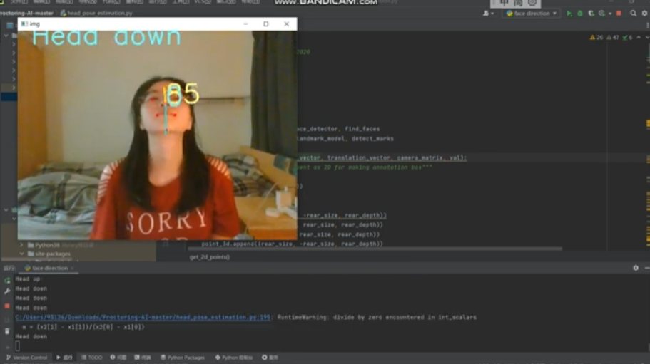

# Eyesight-Direction-Estimation
Group Project for Bio-inspired Artificial Intelligence class on Msc Biorobotics in University of Bristol.

## Face Direction Detection

### Demo：
https://youtu.be/tYvrVyDFFQ0

### Ref: 
https://towardsdatascience.com/real-time-head-pose-estimation-in-python-e52db1bc606a

### Ref GitHub: 
https://github.com/vardanagarwal/Proctoring-AI

### Test
Note： There are a number of problems with cv2 importing, including a possible cv2 compatibility error even if OpenCV is downloaded. I have python 3.8, 3.9 and 3.11 on my computer, so I need to force 3.8 (the python environment that contains the cv2 library) to be selected for the system to solve the problem.

