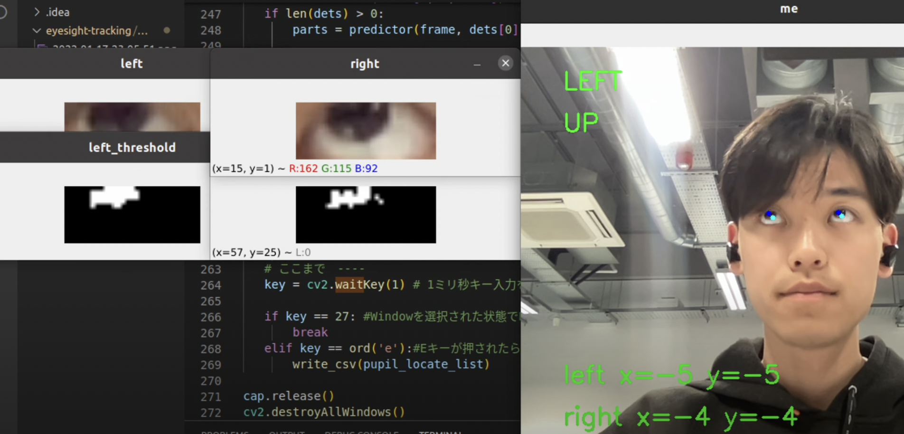

# Eyesight-Direction-Estimation
Group Project for Bio-inspired Artificial Intelligence class on Msc Biorobotics in University of Bristol.

---
## Project Overview
### Problem:
A prosthetic eye is a device used by people who have lost an eye due to an accident or illness to fill the empty space. However, prosthetic eyes that have been used for a long time are unmovable and therefore move differently from the remaining eye, making them look unnatural.

In recent years, a prosthetic eye has been developed called Medpol prosthesis eye, which moves like a normal eyeball by coupling with the muscles of the eye. However, due to its stand is made of porous material, if an infection occurs, it is difficult to cure with medication and surgery is required.


### Solution:
With the recent miniaturisation of electronic devices, eyeball-sized moving devices may be realised. In this case, if the natural direction of gaze could be estimated from facial orientation and its changes, it would be possible to move the eyeball naturally without coupling it to muscles.
 
As a prototype, we create a network that estimates the direction of gaze from facial orientation.

### Customers:
Prosthetic eye user
It potentially help to make the humanoid gaze more friendly to people.

### Demo:
From camera of laptop, estimate eyesight direction from face dierection

---
## Schedule
4/12~4/22: Implementation
  -   Face direction detection (Media pipe by google). By Xinyu

	Eye sight direction detection  by Naoki
	Preparation of NN(RNN) and play with examples by Kuang

By 15th

	Training of Neural Network

  by 20th

 
4/19~22: Presentation Making

 
4/23: Final check
4/24: Presentation recording

---
## Eyesight direction tracking
### Demo:
 https://youtu.be/htRZiP4whYc


### Ref GitHub: 
https://github.com/gakutosasabe/OpenCVEyeTracking

### Trained model for dlib
http://dlib.net/files/shape_predictor_68_face_landmarks.dat.bz2

### Setup and test
Download trained model and place at "/eyesight-tracking/OpenCVEyeTracking/shape_predictor_68_face_landmarks.dat" before setup.
```
$ pyenv global system
$ sudo apt-get install python3-tk
$ sudo apt install tk-dev

$ pyenv install python==3.6
$ pip install opencv-python==4.6.0.66
$ pip install cmake
$ pip install dlib
$ cd eyesight-tracking/OpenCVEyeTracking
$ python eyetracking.py
```
※ I tried on Ubuntu 22.04

Note: dlib sometimes have error on installation. We need cmake before installing dlib. dlib only support python<=3.6, so we need pyenv if on ubuntu. (conda for Arm Ubuntu doesn't support python<=3.6)

Help for error on tkinter on pyenv: https://www.python.ambitious-engineer.com/archives/357




